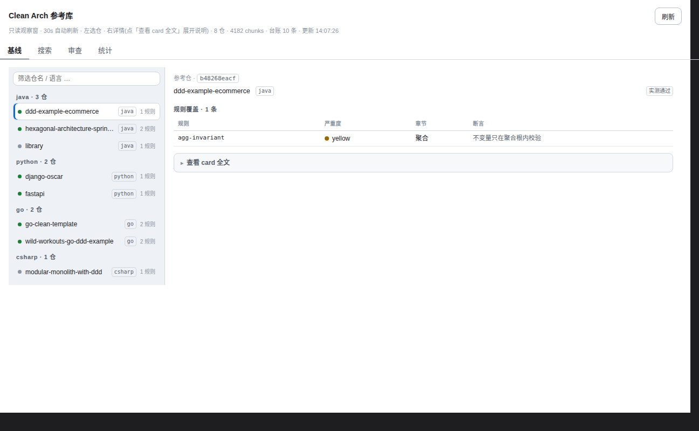

# dsh-ca-ref

**Languages: [English](README.en.md) | [中文](README.md)**

Clean Architecture reference library — a plugin for DSH (DeepSeek Harness).



## Why

When reviewing Clean Arch / DDD / hexagonal projects, the "known-good" answers are scattered across architecture tests and docs in various reference repos, and every review means digging through them again.

This plugin pre-indexes 8 pinned reference repos (Go / Java / C# / TypeScript / Python) into a local FTS5 database, so you can pull the full "answer set" in one call before a review, log the review afterwards, and feed hit statistics back into library curation.

## Quick start

**Prerequisites**: DSH (with web) + pnpm; Node ≥ 24 (`node:sqlite` is built into Node 24).

```bash
cd ~/.dsh/profiles/web                      # your DSH web profile directory
pnpm add github:Ansonfishing/dsh-ca-ref
```

Then add `"dsh-ca-ref"` to the `dsh.profile.bundles` array in `package.json` and restart `dsh`. A "CA Reference Library" tab appears in the conversation view.

The index is built automatically on first use. The corpus defaults to `~/AI/ca-ref` (override with the `CAREF_CORPUS` env var). The corpus is 8 public reference repos — clone URLs and verification commands live in each entry's `verify_cmd` field in `seed/repos.json`. If a corpus item is missing locally, the corresponding checks are skipped automatically (a data gap, not a code bug).

## Features

- **8 pinned reference repos** — pinned to fixed commits; a daily tick runs `git rev-parse HEAD` read-only drift checks, no automatic re-clone.
- **FTS5 full-text search** — over repo assertions, docs, and structure; Chinese matches by substring, English via FTS5; citations carry a `<repo>:<path>` source.
- **Mechanizable rule list** — each rule carries an assertion template and its source; `ca_ref_baseline` returns the full "answer set" for a language in one call (including 8 red flags).
- **Review ledger** — `ca_ref_record` logs a review (project, language, rules hit, evidence); hit statistics feed back into curation.
- **Observation-window panel** — a read-only tab with 30s auto-refresh: baseline (repo list + rule coverage table + full card), search log, review ledger, hit statistics.

## Agent tools

| Tool | Purpose |
|---|---|
| `ca_ref_search` | Full-text search over reference assertions/docs/structure |
| `ca_ref_baseline` | Fetch repo summary cards + rule list + 8 red flags for a language |
| `ca_ref_record` | Log a completed review (project / language / rules hit / evidence) |
| `ca_ref_status` | Library health: pinned SHAs, verification status, index state, ledger size |

A `/ca-ref status\|search\|baseline\|ledger\|stats\|reindex` command channel (with `--json`) feeds the panel.

## No DSH? Take a look anyway

Clone this repo and open `test/harness/index.html` in a browser — a zero-dependency render harness (mock data, `?chrome=0` hides the harness bar).

## Development

```bash
node scripts/smoke.mjs   # smoke: 8 pinned repos + toolchain + index (missing local corpus items are skipped)
```

Local development: after cloning, use `pnpm add link:../path/to/dsh-ca-ref` in your profile. Client-only changes need a browser refresh; Node-side changes (`index.js` / `lib/*.js`) need a `dsh` restart.

## License

[MIT](LICENSE) © Ansonfishing
